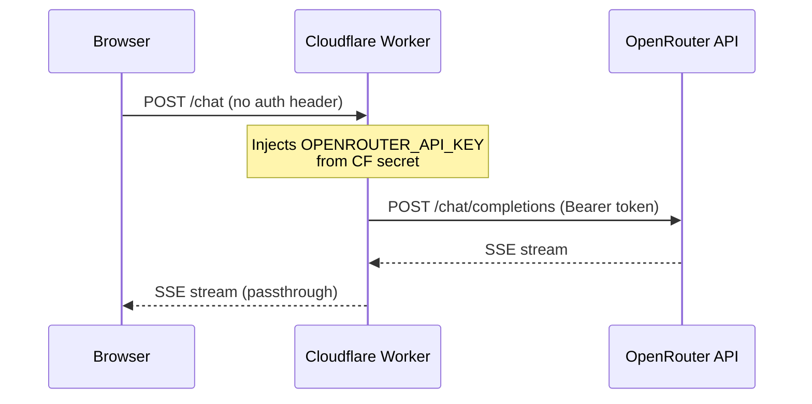

# Dat Tran — 3D Portfolio

Personal portfolio website for **Dat Tran**, a backend developer based in Vietnam.

## Tech Stack

- React 19
- Three.js + React Three Fiber + Drei
- GSAP
- Tailwind CSS v4
- Vite

## Quick Start

**Prerequisites:** Node.js, npm

**Install dependencies**

```bash
npm install
```

**Run locally**

```bash
npm run dev
```

Open [http://localhost:5173](http://localhost:5173) in your browser.

## Chat Feature

The AI chat widget uses [OpenRouter](https://openrouter.ai) proxied through a Cloudflare Worker so the API key never appears in the client bundle.


